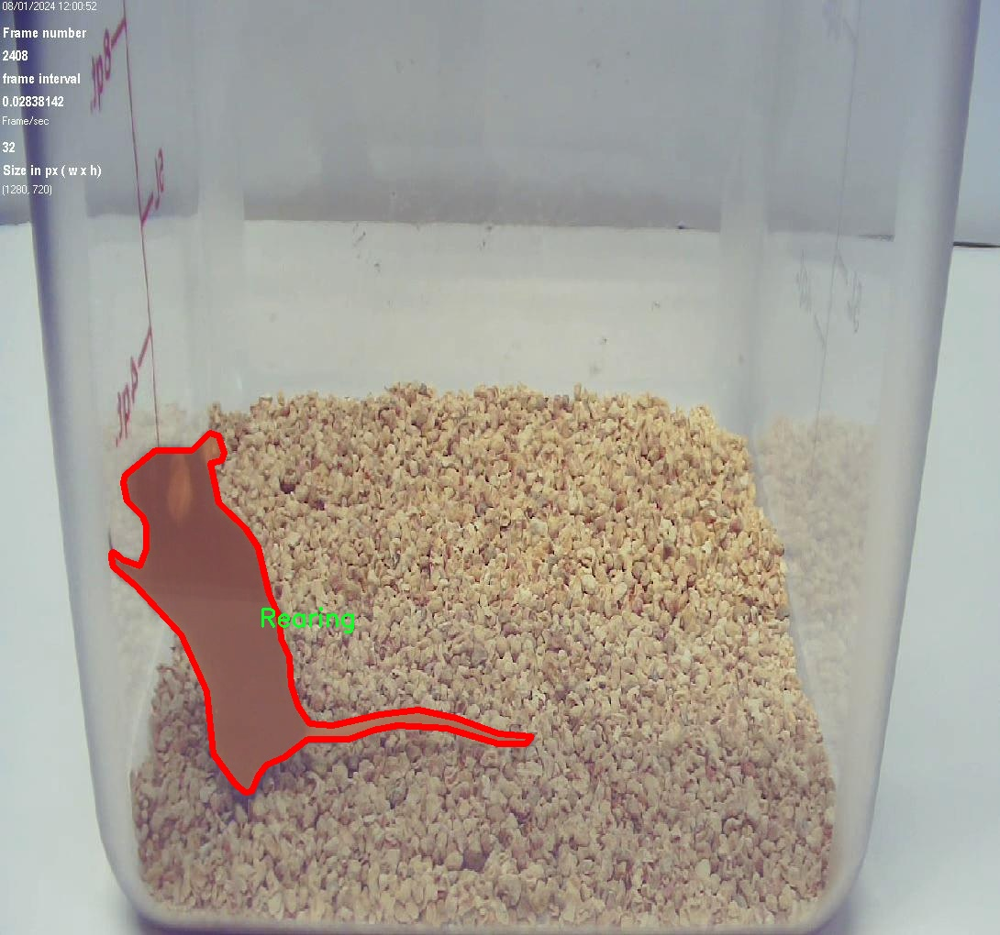

# 小鼠行为识别图像分割系统源码＆数据集分享
 [yolov8-seg-C2f-DWR＆yolov8-seg-swintransformer等50+全套改进创新点发刊_一键训练教程_Web前端展示]

### 1.研究背景与意义

项目参考[ILSVRC ImageNet Large Scale Visual Recognition Challenge](https://gitee.com/YOLOv8_YOLOv11_Segmentation_Studio/projects)

项目来源[AAAI Global Al lnnovation Contest](https://kdocs.cn/l/cszuIiCKVNis)

研究背景与意义

在生物医学研究领域，小鼠作为一种重要的实验动物，广泛应用于药物研发、行为学研究及神经科学等多个领域。小鼠的行为模式不仅能够反映其生理状态，还能为药物作用机制的研究提供重要线索。因此，准确、实时地识别和分析小鼠的行为，对于推动相关研究的进展具有重要意义。传统的行为观察方法往往依赖于人工观察，这不仅耗时耗力，而且容易受到观察者主观因素的影响，导致数据的可靠性和一致性不足。随着计算机视觉技术的快速发展，基于深度学习的行为识别方法逐渐成为研究者们的关注焦点。

YOLO（You Only Look Once）系列模型因其高效的实时目标检测能力而受到广泛应用。YOLOv8作为该系列的最新版本，结合了更为先进的网络结构和算法优化，展现出更高的检测精度和速度。然而，针对小鼠行为识别的具体应用，YOLOv8仍存在一定的局限性，尤其是在复杂背景下的小鼠行为分割和识别方面。因此，基于改进YOLOv8的小鼠行为识别图像分割系统的研究，具有重要的学术价值和实际意义。

本研究将利用“Drug Behavior V2”数据集，该数据集包含1500幅小鼠行为图像，涵盖了10种不同的行为类别，包括身体梳理、头部梳理、头部颤动、后肢站立、跳跃、运动、翻身、静止、竖立和挖掘等。这些行为不仅涉及小鼠的日常活动，还能反映其对外界刺激的反应和生理状态的变化。通过对这些行为的准确识别与分割，研究者能够更深入地理解小鼠在不同实验条件下的行为表现，为药物效应的评估提供更为客观的数据支持。

在技术层面，本研究将对YOLOv8进行改进，结合图像分割技术，以提高小鼠行为识别的准确性和鲁棒性。通过引入更为精细的特征提取模块和多尺度处理策略，旨在解决小鼠在复杂背景下的行为分割问题。此外，研究还将探索数据增强技术，以提高模型的泛化能力，从而在不同实验条件下都能保持良好的识别性能。

本研究的意义不仅在于推动小鼠行为识别技术的发展，更在于为生物医学研究提供一种高效、客观的行为分析工具。通过实现对小鼠行为的自动化识别与分析，研究者能够节省大量的时间和人力成本，提升实验数据的可靠性和一致性。此外，该系统的成功应用还将为其他动物行为研究提供借鉴，推动动物行为学及相关领域的进一步发展。

综上所述，基于改进YOLOv8的小鼠行为识别图像分割系统的研究，既具有重要的理论价值，也具备广泛的应用前景。通过该研究，期望能够为小鼠行为研究提供新的技术手段，促进生物医学领域的进步与创新。

### 2.图片演示


##### 注意：由于此博客编辑较早，上面“2.图片演示”和“3.视频演示”展示的系统图片或者视频可能为老版本，新版本在老版本的基础上升级如下：（实际效果以升级的新版本为准）

  （1）适配了YOLOV8的“目标检测”模型和“实例分割”模型，通过加载相应的权重（.pt）文件即可自适应加载模型。

  （2）支持“图片识别”、“视频识别”、“摄像头实时识别”三种识别模式。

  （3）支持“图片识别”、“视频识别”、“摄像头实时识别”三种识别结果保存导出，解决手动导出（容易卡顿出现爆内存）存在的问题，识别完自动保存结果并导出到tempDir中。

  （4）支持Web前端系统中的标题、背景图等自定义修改，后面提供修改教程。

  另外本项目提供训练的数据集和训练教程,暂不提供权重文件（best.pt）,需要您按照教程进行训练后实现图片演示和Web前端界面演示的效果。

### 3.视频演示

[3.1 视频演示](https://www.bilibili.com/video/BV1pL21YWEH6/)

### 4.数据集信息展示

##### 4.1 本项目数据集详细数据（类别数＆类别名）

nc: 10
names: ['BodyGooming', 'HeadGrooming', 'HeadTremor', 'HindlegStand', 'Jumping', 'Locomotion', 'Loss of Righting', 'Rearing', 'Still', 'Treading-Digging']


##### 4.2 本项目数据集信息介绍

数据集信息展示

在本研究中，我们采用了名为“Drug Behavior V2”的数据集，以训练和改进YOLOv8-seg的小鼠行为识别图像分割系统。该数据集专注于小鼠在不同药物影响下的行为表现，涵盖了多种行为类别，旨在为生物医学研究提供高效的行为分析工具。数据集的设计不仅考虑到了行为的多样性，还强调了图像分割的精确性，以便于后续的机器学习模型进行有效的训练和推理。

“Drug Behavior V2”数据集包含10个主要的行为类别，分别是：Body Grooming（身体梳理）、Head Grooming（头部梳理）、Head Tremor（头部颤抖）、Hindleg Stand（后腿站立）、Jumping（跳跃）、Locomotion（运动）、Loss of Righting（失去翻身能力）、Rearing（直立）、Still（静止）和Treading-Digging（踏掘）。这些类别不仅反映了小鼠在不同环境和药物影响下的自然行为，还为研究人员提供了丰富的行为特征分析的基础。

在数据集的构建过程中，研究团队采用了高质量的图像采集技术，确保每个行为类别的图像样本具有足够的清晰度和细节。这些图像样本来自于经过严格控制的实验环境，确保了数据的可靠性和可重复性。每个类别的样本数量经过精心设计，以确保模型在训练过程中能够充分学习到每种行为的特征，同时避免过拟合现象的发生。

为了增强数据集的多样性和鲁棒性，研究团队还对图像进行了多种数据增强处理，包括旋转、缩放、翻转和亮度调整等。这些处理不仅提高了模型的泛化能力，还使得小鼠行为的识别更加准确和高效。此外，数据集中的每个图像都配有详细的标注信息，确保在训练过程中，模型能够清晰地识别出不同的行为类别及其对应的图像区域。

在训练YOLOv8-seg模型时，我们将利用“Drug Behavior V2”数据集的丰富信息，通过深度学习算法对小鼠行为进行精准的图像分割。该模型将能够自动识别和分割出小鼠在实验过程中表现出的各种行为，进而为药物效应的分析提供定量数据支持。这一过程不仅能够提高小鼠行为识别的效率，还将为药物研发和行为科学研究提供新的视角和方法。

综上所述，“Drug Behavior V2”数据集为本研究提供了坚实的基础，涵盖了多样化的小鼠行为类别，并通过高质量的图像和精确的标注，为YOLOv8-seg模型的训练和改进提供了必要的数据支持。通过对该数据集的深入分析和应用，我们期望能够推动小鼠行为识别技术的发展，为相关领域的研究提供更为精准和高效的工具。





### 5.全套项目环境部署视频教程（零基础手把手教学）

[5.1 环境部署教程链接（零基础手把手教学）](https://www.bilibili.com/video/BV1jG4Ve4E9t/?vd_source=bc9aec86d164b67a7004b996143742dc)


[5.2 安装Python虚拟环境创建和依赖库安装视频教程链接（零基础手把手教学）](https://www.bilibili.com/video/BV1nA4VeYEze/?vd_source=bc9aec86d164b67a7004b996143742dc)

### 6.手把手YOLOV8-seg训练视频教程（零基础小白有手就能学会）

[6.1 手把手YOLOV8-seg训练视频教程（零基础小白有手就能学会）](https://www.bilibili.com/video/BV1cA4VeYETe/?vd_source=bc9aec86d164b67a7004b996143742dc)


按照上面的训练视频教程链接加载项目提供的数据集，运行train.py即可开始训练



     Epoch   gpu_mem       box       obj       cls    labels  img_size
     1/200     0G   0.01576   0.01955  0.007536        22      1280: 100%|██████████| 849/849 [14:42<00:00,  1.04s/it]
               Class     Images     Labels          P          R     mAP@.5 mAP@.5:.95: 100%|██████████| 213/213 [01:14<00:00,  2.87it/s]
                 all       3395      17314      0.994      0.957      0.0957      0.0843

     Epoch   gpu_mem       box       obj       cls    labels  img_size
     2/200     0G   0.01578   0.01923  0.007006        22      1280: 100%|██████████| 849/849 [14:44<00:00,  1.04s/it]
               Class     Images     Labels          P          R     mAP@.5 mAP@.5:.95: 100%|██████████| 213/213 [01:12<00:00,  2.95it/s]
                 all       3395      17314      0.996      0.956      0.0957      0.0845

     Epoch   gpu_mem       box       obj       cls    labels  img_size
     3/200     0G   0.01561    0.0191  0.006895        27      1280: 100%|██████████| 849/849 [10:56<00:00,  1.29it/s]
               Class     Images     Labels          P          R     mAP@.5 mAP@.5:.95: 100%|███████   | 187/213 [00:52<00:00,  4.04it/s]
                 all       3395      17314      0.996      0.957      0.0957      0.0845


### 7.50+种全套YOLOV8-seg创新点代码加载调参视频教程（一键加载写好的改进模型的配置文件）

[7.1 50+种全套YOLOV8-seg创新点代码加载调参视频教程（一键加载写好的改进模型的配置文件）](https://www.bilibili.com/video/BV1Hw4VePEXv/?vd_source=bc9aec86d164b67a7004b996143742dc)

### 8.YOLOV8-seg图像分割算法原理

原始YOLOv8-seg算法原理

YOLOv8-seg算法是基于YOLOv8目标检测框架的一个重要扩展，专注于实现高效的实例分割任务。自2023年1月10日由Ultralytics公司推出以来，YOLOv8系列在目标检测领域取得了显著的进展，尤其是在精度和速度方面的提升，使其成为计算机视觉领域的一个重要工具。YOLOv8-seg算法不仅保留了YOLOv8的高效性和准确性，还引入了实例分割的功能，使得其在复杂场景下的应用更加广泛。

YOLOv8-seg算法的核心在于其网络结构的设计，该结构由输入端、骨干网络、颈部网络和头部网络四个主要部分组成。输入端通过马赛克数据增强、自适应锚框计算和自适应灰度填充等技术，增强了模型对不同输入数据的适应能力。这种数据增强方法不仅提高了模型的鲁棒性，还使得模型在面对不同光照、视角和背景变化时，能够保持较高的检测精度。

在骨干网络部分，YOLOv8-seg采用了C2f模块和SPPF结构。C2f模块通过丰富的分支跨层连接，增强了特征的梯度流，使得模型在特征提取时能够捕捉到更为细致的信息。这一设计不仅提升了特征表示能力，还在一定程度上减小了模型的参数量，确保了计算效率。而SPPF结构则通过空间金字塔池化的方式，进一步增强了模型对多尺度特征的捕捉能力，使得YOLOv8-seg在处理不同尺寸的目标时表现得更加出色。

颈部网络采用了路径聚合网络（PAN）结构，旨在加强不同尺度对象的特征融合能力。PAN通过对来自骨干网络不同层次的特征图进行融合，能够有效地捕捉到目标的多尺度信息。这种特征融合的策略，使得YOLOv8-seg在面对复杂场景时，能够更好地理解和定位目标，提升了模型的整体性能。

头部网络则是YOLOv8-seg的关键部分，负责最终的目标检测和实例分割任务。在这一部分，YOLOv8-seg将分类和检测过程进行了有效的解耦，采用了Task-Aligned Assigner分配策略，以优化正负样本的分配。这一策略通过结合分类与回归的分数加权结果，确保了模型在训练过程中能够更好地学习到目标的特征。损失计算方面，YOLOv8-seg结合了二元交叉熵损失（BCELoss）和分布焦点损失（DFLoss），以提升模型对边界框预测的精准性。此外，完全交并比损失函数（CIOULoss）的引入，进一步增强了模型在实例分割任务中的表现。

YOLOv8-seg在实例分割任务中的表现得益于其独特的无锚框检测头设计。与传统的锚框方法相比，无锚框检测头能够减少锚框预测的数量，从而加速非最大抑制（NMS）过程，提高了模型的推理速度。这一设计不仅提升了YOLOv8-seg在实时应用中的效率，也使得其在处理复杂场景时，能够快速而准确地进行目标分割。

值得一提的是，YOLOv8-seg在模型的轻量化方面也做出了重要贡献。通过对不同尺度模型调整通道数，YOLOv8-seg实现了更为精简的模型结构，使得其在保证高精度的同时，能够在资源受限的环境中运行。这一特性使得YOLOv8-seg在智能监控、自动驾驶以及人脸识别等应用场景中，具备了更强的适应性和实用性。

总的来说，YOLOv8-seg算法在YOLOv8的基础上，通过优化网络结构、引入先进的特征融合技术和损失计算策略，成功实现了高效的实例分割任务。其在精度和速度上的显著提升，使得YOLOv8-seg成为计算机视觉领域中一个极具潜力的工具，能够广泛应用于各种复杂的视觉任务中。随着技术的不断进步，YOLOv8-seg无疑将在未来的研究和应用中发挥更加重要的作用。


### 9.系统功能展示（检测对象为举例，实际内容以本项目数据集为准）

图9.1.系统支持检测结果表格显示

  图9.2.系统支持置信度和IOU阈值手动调节

  图9.3.系统支持自定义加载权重文件best.pt(需要你通过步骤5中训练获得)

  图9.4.系统支持摄像头实时识别

  图9.5.系统支持图片识别

  图9.6.系统支持视频识别

  图9.7.系统支持识别结果文件自动保存

  图9.8.系统支持Excel导出检测结果数据


### 10.50+种全套YOLOV8-seg创新点原理讲解（非科班也可以轻松写刊发刊，V11版本正在科研待更新）

#### 10.1 由于篇幅限制，每个创新点的具体原理讲解就不一一展开，具体见下列网址中的创新点对应子项目的技术原理博客网址【Blog】：


[10.1 50+种全套YOLOV8-seg创新点原理讲解链接](https://gitee.com/qunmasj/good)

#### 10.2 部分改进模块原理讲解(完整的改进原理见上图和技术博客链接)【如果此小节的图加载失败可以通过CSDN或者Github搜索该博客的标题访问原始博客，原始博客图片显示正常】

### YOLOv8简介
#### Backbone
Darknet-53
53指的是“52层卷积”+output layer。

借鉴了其他算法的这些设计思想

借鉴了VGG的思想，使用了较多的3×3卷积，在每一次池化操作后，将通道数翻倍；

借鉴了network in network的思想，使用全局平均池化（global average pooling）做预测，并把1×1的卷积核置于3×3的卷积核之间，用来压缩特征；（我没找到这一步体现在哪里）


使用了批归一化层稳定模型训练，加速收敛，并且起到正则化作用。

    以上三点为Darknet19借鉴其他模型的点。Darknet53当然是在继承了Darknet19的这些优点的基础上再新增了下面这些优点的。因此列在了这里

借鉴了ResNet的思想，在网络中大量使用了残差连接，因此网络结构可以设计的很深，并且缓解了训练中梯度消失的问题，使得模型更容易收敛。

使用步长为2的卷积层代替池化层实现降采样。（这一点在经典的Darknet-53上是很明显的，output的长和宽从256降到128，再降低到64，一路降低到8，应该是通过步长为2的卷积层实现的；在YOLOv8的卷积层中也有体现，比如图中我标出的这些位置）

#### 特征融合

模型架构图如下

  Darknet-53的特点可以这样概括：（Conv卷积模块+Residual Block残差块）串行叠加4次

  Conv卷积层+Residual Block残差网络就被称为一个stage


上面红色指出的那个，原始的Darknet-53里面有一层 卷积，在YOLOv8里面，把一层卷积移除了

为什么移除呢？

        原始Darknet-53模型中间加的这个卷积层做了什么？滤波器（卷积核）的个数从 上一个卷积层的512个，先增加到1024个卷积核，然后下一层卷积的卷积核的个数又降低到512个

        移除掉这一层以后，少了1024个卷积核，就可以少做1024次卷积运算，同时也少了1024个3×3的卷积核的参数，也就是少了9×1024个参数需要拟合。这样可以大大减少了模型的参数，（相当于做了轻量化吧）

        移除掉这个卷积层，可能是因为作者发现移除掉这个卷积层以后，模型的score有所提升，所以才移除掉的。为什么移除掉以后，分数有所提高呢？可能是因为多了这些参数就容易，参数过多导致模型在训练集删过拟合，但是在测试集上表现很差，最终模型的分数比较低。你移除掉这个卷积层以后，参数减少了，过拟合现象不那么严重了，泛化能力增强了。当然这个是，拿着你做实验的结论，反过来再找补，再去强行解释这种现象的合理性。


通过MMdetection官方绘制册这个图我们可以看到，进来的这张图片经过一个“Feature Pyramid Network(简称FPN)”，然后最后的P3、P4、P5传递给下一层的Neck和Head去做识别任务。 PAN（Path Aggregation Network）


“FPN是自顶向下，将高层的强语义特征传递下来。PAN就是在FPN的后面添加一个自底向上的金字塔，对FPN补充，将低层的强定位特征传递上去，

FPN是自顶（小尺寸，卷积次数多得到的结果，语义信息丰富）向下（大尺寸，卷积次数少得到的结果），将高层的强语义特征传递下来，对整个金字塔进行增强，不过只增强了语义信息，对定位信息没有传递。PAN就是针对这一点，在FPN的后面添加一个自底（卷积次数少，大尺寸）向上（卷积次数多，小尺寸，语义信息丰富）的金字塔，对FPN补充，将低层的强定位特征传递上去，又被称之为“双塔战术”。

FPN层自顶向下传达强语义特征，而特征金字塔则自底向上传达强定位特征，两两联手，从不同的主干层对不同的检测层进行参数聚合,这样的操作确实很皮。
#### 自底向上增强


而 PAN（Path Aggregation Network）是对 FPN 的一种改进，它的设计理念是在 FPN 后面添加一个自底向上的金字塔。PAN 引入了路径聚合的方式，通过将浅层特征图（低分辨率但语义信息较弱）和深层特征图（高分辨率但语义信息丰富）进行聚合，并沿着特定的路径传递特征信息，将低层的强定位特征传递上去。这样的操作能够进一步增强多尺度特征的表达能力，使得 PAN 在目标检测任务中表现更加优秀。


### Gold-YOLO简介
YOLO系列模型面世至今已有8年，由于其优异的性能，已成为目标检测领域的标杆。在系列模型经过十多个不同版本的改进发展逐渐稳定完善的今天，研究人员更多关注于单个计算模块内结构的精细调整，或是head部分和训练方法上的改进。但这并不意味着现有模式已是最优解。

当前YOLO系列模型通常采用类FPN方法进行信息融合，而这一结构在融合跨层信息时存在信息损失的问题。针对这一问题，我们提出了全新的信息聚集-分发（Gather-and-Distribute Mechanism）GD机制，通过在全局视野上对不同层级的特征进行统一的聚集融合并分发注入到不同层级中，构建更加充分高效的信息交互融合机制，并基于GD机制构建了Gold-YOLO。在COCO数据集中，我们的Gold-YOLO超越了现有的YOLO系列，实现了精度-速度曲线上的SOTA。


精度和速度曲线（TensorRT7）


精度和速度曲线（TensorRT8）
传统YOLO的问题
在检测模型中，通常先经过backbone提取得到一系列不同层级的特征，FPN利用了backbone的这一特点，构建了相应的融合结构：不层级的特征包含着不同大小物体的位置信息，虽然这些特征包含的信息不同，但这些特征在相互融合后能够互相弥补彼此缺失的信息，增强每一层级信息的丰富程度，提升网络性能。

原始的FPN结构由于其层层递进的信息融合模式，使得相邻层的信息能够充分融合，但也导致了跨层信息融合存在问题：当跨层的信息进行交互融合时，由于没有直连的交互通路，只能依靠中间层充当“中介”进行融合，导致了一定的信息损失。之前的许多工作中都关注到了这一问题，而解决方案通常是通过添加shortcut增加更多的路径，以增强信息流动。

然而传统的FPN结构即便改进后，由于网络中路径过多，且交互方式不直接，基于FPN思想的信息融合结构仍然存在跨层信息交互困难和信息损失的问题。

#### Gold-YOLO：全新的信息融合交互机制


#### Gold-YOLO架构
参考该博客提出的一种全新的信息交互融合机制：信息聚集-分发机制(Gather-and-Distribute Mechanism)。该机制通过在全局上融合不同层次的特征得到全局信息，并将全局信息注入到不同层级的特征中，实现了高效的信息交互和融合。在不显著增加延迟的情况下GD机制显著增强了Neck部分的信息融合能力，提高了模型对不同大小物体的检测能力。

GD机制通过三个模块实现：信息对齐模块(FAM)、信息融合模块(IFM)和信息注入模块(Inject)。

信息对齐模块负责收集并对齐不同层级不同大小的特征

信息融合模块通过使用卷积或Transformer算子对对齐后的的特征进行融合，得到全局信息

信息注入模块将全局信息注入到不同层级中

在Gold-YOLO中，针对模型需要检测不同大小的物体的需要，并权衡精度和速度，我们构建了两个GD分支对信息进行融合：低层级信息聚集-分发分支(Low-GD)和高层级信息聚集-分发分支(High-GD)，分别基于卷积和transformer提取和融合特征信息。

此外,为了促进局部信息的流动，我们借鉴现有工作，构建了一个轻量级的邻接层融合模块，该模块在局部尺度上结合了邻近层的特征，进一步提升了模型性能。我们还引入并验证了预训练方法对YOLO模型的有效性，通过在ImageNet 1K上使用MAE方法对主干进行预训练，显著提高了模型的收敛速度和精度。


### 11.项目核心源码讲解（再也不用担心看不懂代码逻辑）

#### 11.1 ultralytics\data\utils.py

以下是代码中最核心的部分，并附上详细的中文注释：

```python
import os
import hashlib
from pathlib import Path
from PIL import Image, ImageOps
import numpy as np
import cv2

# 定义支持的图像格式
IMG_FORMATS = 'bmp', 'jpeg', 'jpg', 'png', 'tif', 'tiff', 'webp'  # 图像后缀

def img2label_paths(img_paths):
    """根据图像路径定义标签路径。"""
    sa, sb = f'{os.sep}images{os.sep}', f'{os.sep}labels{os.sep}'  # /images/, /labels/ 子字符串
    return [sb.join(x.rsplit(sa, 1)).rsplit('.', 1)[0] + '.txt' for x in img_paths]

def get_hash(paths):
    """返回路径列表（文件或目录）的单个哈希值。"""
    size = sum(os.path.getsize(p) for p in paths if os.path.exists(p))  # 计算文件大小
    h = hashlib.sha256(str(size).encode())  # 基于大小生成哈希
    h.update(''.join(paths).encode())  # 基于路径生成哈希
    return h.hexdigest()  # 返回哈希值

def exif_size(img: Image.Image):
    """返回经过EXIF校正的PIL图像大小。"""
    s = img.size  # (宽度, 高度)
    if img.format == 'JPEG':  # 仅支持JPEG图像
        exif = img.getexif()  # 获取EXIF信息
        if exif:
            rotation = exif.get(274, None)  # 获取方向标签
            if rotation in [6, 8]:  # 旋转270或90度
                s = s[1], s[0]  # 交换宽高
    return s

def verify_image(im_file):
    """验证单个图像的有效性。"""
    nf, nc, msg = 0, 0, ''  # 计数器初始化
    try:
        im = Image.open(im_file)  # 打开图像
        im.verify()  # 验证图像
        shape = exif_size(im)  # 获取图像大小
        assert (shape[0] > 9) & (shape[1] > 9), f'图像大小 {shape} <10 像素'
        assert im.format.lower() in IMG_FORMATS, f'无效的图像格式 {im.format}'
        nf = 1  # 图像有效
    except Exception as e:
        nc = 1  # 图像无效
        msg = f'忽略损坏的图像: {e}'
    return nf, nc, msg

def polygon2mask(imgsz, polygons, color=1):
    """
    将多边形列表转换为指定图像大小的二进制掩码。

    Args:
        imgsz (tuple): 图像大小 (高度, 宽度)。
        polygons (list[np.ndarray]): 多边形列表，每个多边形是一个形状为 [N, M] 的数组。
        color (int, optional): 掩码中填充多边形的颜色值。默认为1。

    Returns:
        (np.ndarray): 指定图像大小的二进制掩码。
    """
    mask = np.zeros(imgsz, dtype=np.uint8)  # 创建空掩码
    polygons = np.asarray(polygons, dtype=np.int32)  # 转换为整型数组
    polygons = polygons.reshape((polygons.shape[0], -1, 2))  # 重塑为多边形格式
    cv2.fillPoly(mask, polygons, color=color)  # 填充多边形
    return mask  # 返回掩码

def check_det_dataset(dataset):
    """
    下载、验证和/或解压数据集（如果在本地未找到）。

    Args:
        dataset (str): 数据集路径或描述符（如YAML文件）。

    Returns:
        (dict): 解析后的数据集信息和路径。
    """
    # 这里省略了具体的实现细节，主要是处理数据集的下载和路径解析
    pass  # 具体实现略去

# 其他功能函数和类的定义省略，以上是核心部分的简化和注释
```

### 说明：
1. **核心功能**：保留了图像路径与标签路径的转换、哈希生成、EXIF信息处理、图像验证、以及多边形到掩码的转换等功能。
2. **注释**：每个函数都有详细的中文注释，说明其功能、参数和返回值，便于理解和使用。
3. **简化**：为了突出核心部分，省略了一些具体实现细节和不必要的功能，专注于数据集处理和图像验证的基本逻辑。

该文件 `ultralytics\data\utils.py` 是 Ultralytics YOLO 项目中的一个工具模块，主要用于处理与数据集相关的各种功能，包括图像和标签的验证、数据集的下载和解析、图像处理等。以下是对文件中主要功能的逐步解析。

首先，文件导入了一系列必要的库，包括用于文件操作的 `os` 和 `pathlib`，用于图像处理的 `PIL` 和 `cv2`，以及用于数值计算的 `numpy`。此外，还导入了一些自定义的工具函数和常量，例如 `check_class_names` 和 `yaml_load`，这些都是在 YOLO 项目中使用的。

文件定义了一些常量，例如支持的图像和视频格式，以及一个用于控制数据加载器的全局变量 `PIN_MEMORY`。接下来，定义了一些函数：

- `img2label_paths(img_paths)`：根据图像路径生成对应的标签路径。它将图像路径中的 `/images/` 替换为 `/labels/`，并将文件扩展名更改为 `.txt`。

- `get_hash(paths)`：计算给定文件或目录路径列表的 SHA-256 哈希值，以便于文件完整性检查。

- `exif_size(img)`：返回经过 EXIF 校正的图像大小，主要用于处理 JPEG 格式的图像。

- `verify_image(args)`：验证单个图像的有效性，包括检查图像格式、大小和是否损坏。若图像损坏，则尝试修复并保存。

- `verify_image_label(args)`：验证图像和标签的配对，确保图像和标签的有效性，并检查标签的格式和内容。

- `polygon2mask(imgsz, polygons, color=1, downsample_ratio=1)`：将多边形转换为二进制掩码，返回指定大小的图像掩码。

- `polygons2masks(imgsz, polygons, color, downsample_ratio=1)`：将多个多边形转换为一组二进制掩码。

- `find_dataset_yaml(path)`：在指定路径中查找与数据集相关的 YAML 文件，确保只找到一个有效的 YAML 文件。

- `check_det_dataset(dataset, autodownload=True)`：检查检测数据集的可用性，如果数据集未找到，则可以选择自动下载并解压数据集，同时解析 YAML 文件，确保必要的字段存在。

- `check_cls_dataset(dataset, split='')`：检查分类数据集的可用性，类似于 `check_det_dataset`，但针对分类任务。

- `HUBDatasetStats` 类：用于生成 HUB 数据集的 JSON 文件和相应的目录。它包含初始化方法和一些处理图像和生成统计信息的方法。

- `compress_one_image(f, f_new=None, max_dim=1920, quality=50)`：压缩单个图像文件，保持其宽高比和质量。

- `autosplit(path, weights=(0.9, 0.1, 0.0), annotated_only=False)`：自动将数据集拆分为训练、验证和测试集，并将结果保存到文本文件中。

整体而言，该文件提供了一系列工具函数和类，用于简化数据集的管理和处理，确保数据集的完整性和有效性，并为后续的模型训练和评估提供支持。

#### 11.2 ultralytics\data\dataset.py

以下是经过简化并添加详细中文注释的核心代码部分：

```python
import numpy as np
import torch
from pathlib import Path
from ultralytics.utils import TQDM, LOGGER, get_hash, img2label_paths, verify_image_label

# Ultralytics 数据集缓存版本
DATASET_CACHE_VERSION = '1.0.3'

class YOLODataset:
    """
    YOLO 数据集类，用于加载 YOLO 格式的目标检测和/或分割标签。

    参数:
        data (dict, optional): 数据集的 YAML 字典。默认为 None。
        use_segments (bool, optional): 如果为 True，则使用分割掩码作为标签。默认为 False。
        use_keypoints (bool, optional): 如果为 True，则使用关键点作为标签。默认为 False。
    """

    def __init__(self, data=None, use_segments=False, use_keypoints=False):
        """初始化 YOLODataset，配置分割和关键点的选项。"""
        self.use_segments = use_segments
        self.use_keypoints = use_keypoints
        self.data = data
        assert not (self.use_segments and self.use_keypoints), '不能同时使用分割和关键点。'

    def cache_labels(self, path=Path('./labels.cache')):
        """
        缓存数据集标签，检查图像并读取形状。

        参数:
            path (Path): 保存缓存文件的路径（默认: Path('./labels.cache')）。
        返回:
            (dict): 标签字典。
        """
        x = {'labels': []}  # 初始化标签字典
        nm, nf, ne, nc, msgs = 0, 0, 0, 0, []  # 统计缺失、找到、空、损坏的图像数量
        total = len(self.im_files)  # 图像文件总数

        # 使用多线程池来验证图像和标签
        with ThreadPool(NUM_THREADS) as pool:
            results = pool.imap(func=verify_image_label,
                                iterable=zip(self.im_files, self.label_files))
            pbar = TQDM(results, desc='扫描标签...', total=total)
            for im_file, lb, shape, segments, keypoint, nm_f, nf_f, ne_f, nc_f, msg in pbar:
                nm += nm_f
                nf += nf_f
                ne += ne_f
                nc += nc_f
                if im_file:
                    x['labels'].append(
                        dict(
                            im_file=im_file,
                            shape=shape,
                            cls=lb[:, 0:1],  # 类别
                            bboxes=lb[:, 1:],  # 边界框
                            segments=segments,
                            keypoints=keypoint,
                            normalized=True,
                            bbox_format='xywh'))  # 边界框格式
                if msg:
                    msgs.append(msg)
                pbar.desc = f'扫描标签... {nf} 张图像, {nm + ne} 背景, {nc} 损坏'
            pbar.close()

        if msgs:
            LOGGER.info('\n'.join(msgs))  # 记录警告信息
        x['hash'] = get_hash(self.label_files + self.im_files)  # 生成标签文件和图像文件的哈希值
        save_dataset_cache_file(self.prefix, path, x)  # 保存缓存文件
        return x

    def get_labels(self):
        """返回 YOLO 训练的标签字典。"""
        self.label_files = img2label_paths(self.im_files)  # 获取标签文件路径
        cache_path = Path(self.label_files[0]).parent.with_suffix('.cache')  # 缓存文件路径
        try:
            cache, exists = load_dataset_cache_file(cache_path), True  # 尝试加载缓存文件
            assert cache['version'] == DATASET_CACHE_VERSION  # 检查版本
            assert cache['hash'] == get_hash(self.label_files + self.im_files)  # 检查哈希值
        except (FileNotFoundError, AssertionError):
            cache, exists = self.cache_labels(cache_path), False  # 如果加载失败，则缓存标签

        # 处理缓存结果
        labels = cache['labels']
        if not labels:
            LOGGER.warning(f'警告 ⚠️ 在 {cache_path} 中未找到图像，训练可能无法正常工作。')
        self.im_files = [lb['im_file'] for lb in labels]  # 更新图像文件列表
        return labels  # 返回标签

def load_dataset_cache_file(path):
    """从路径加载 Ultralytics *.cache 字典。"""
    cache = np.load(str(path), allow_pickle=True).item()  # 加载字典
    return cache

def save_dataset_cache_file(prefix, path, x):
    """将 Ultralytics 数据集 *.cache 字典 x 保存到路径。"""
    x['version'] = DATASET_CACHE_VERSION  # 添加缓存版本
    if path.exists():
        path.unlink()  # 如果存在，则删除旧的缓存文件
    np.save(str(path), x)  # 保存缓存
    LOGGER.info(f'{prefix} 新缓存已创建: {path}')  # 记录缓存创建信息
```

### 代码说明：
1. **YOLODataset 类**：负责加载和处理 YOLO 格式的数据集，支持目标检测和分割。
2. **cache_labels 方法**：缓存标签并验证图像的有效性，返回标签字典。
3. **get_labels 方法**：获取标签，尝试从缓存加载，如果失败则重新缓存。
4. **load_dataset_cache_file 和 save_dataset_cache_file 方法**：用于加载和保存数据集的缓存文件，优化数据加载速度。

这个程序文件是Ultralytics YOLO框架中的数据集处理模块，主要用于加载和处理YOLO格式的目标检测和分割数据集。文件中定义了几个类和函数，分别用于不同类型的数据集。

首先，`YOLODataset`类继承自`BaseDataset`，用于加载YOLO格式的数据集。它的构造函数接收一些参数，包括数据集的配置、是否使用分割掩码和关键点等。该类提供了多个方法，其中`cache_labels`方法用于缓存数据集标签，检查图像的有效性并读取其形状。它会生成一个包含标签信息的字典，并将其保存到指定的缓存文件中。

`get_labels`方法用于获取YOLO训练所需的标签字典。它会尝试加载之前生成的缓存文件，如果缓存文件不存在或不匹配，则会调用`cache_labels`方法重新生成缓存。此方法还会检查标签的完整性，确保框和分割掩码的数量一致。

`build_transforms`方法用于构建数据增强的转换操作，依据传入的超参数设置进行不同的图像处理。`close_mosaic`方法则用于关闭马赛克增强，并重新构建转换操作。

`update_labels_info`方法用于自定义标签格式，处理标签中的边界框、分割和关键点信息。`collate_fn`方法用于将多个样本合并成一个批次，方便后续的训练过程。

接下来，`ClassificationDataset`类用于处理YOLO分类数据集，继承自`torchvision.datasets.ImageFolder`。它的构造函数接收数据集路径、参数设置、数据增强和缓存选项。`__getitem__`方法用于返回指定索引的样本和目标，支持从内存或磁盘加载图像。

`verify_images`方法用于验证数据集中所有图像的有效性，确保没有损坏的图像。它会尝试加载缓存文件，如果加载失败，则会扫描数据集并记录有效和无效的图像。

此外，文件中还定义了两个辅助函数`load_dataset_cache_file`和`save_dataset_cache_file`，分别用于加载和保存数据集的缓存文件。

最后，`SemanticDataset`类是一个占位符，表示语义分割数据集，当前没有实现具体的方法和属性。

整体而言，这个文件的主要功能是提供一种高效的方式来加载、验证和处理YOLO格式的数据集，以便于后续的模型训练和评估。

#### 11.3 ui.py

```python
import sys
import subprocess

def run_script(script_path):
    """
    使用当前 Python 环境运行指定的脚本。

    Args:
        script_path (str): 要运行的脚本路径

    Returns:
        None
    """
    # 获取当前 Python 解释器的路径
    python_path = sys.executable

    # 构建运行命令，使用 streamlit 运行指定的脚本
    command = f'"{python_path}" -m streamlit run "{script_path}"'

    # 执行命令并等待其完成
    result = subprocess.run(command, shell=True)
    
    # 检查命令执行的返回码，如果不为0，表示执行出错
    if result.returncode != 0:
        print("脚本运行出错。")


# 实例化并运行应用
if __name__ == "__main__":
    # 指定要运行的脚本路径
    script_path = "web.py"  # 这里可以直接指定脚本名称，假设在当前目录下

    # 调用函数运行脚本
    run_script(script_path)
```

### 代码核心部分说明：
1. **导入模块**：
   - `sys`：用于获取当前 Python 解释器的路径。
   - `subprocess`：用于执行外部命令。

2. **`run_script` 函数**：
   - 输入参数 `script_path`：要运行的 Python 脚本的路径。
   - 使用 `sys.executable` 获取当前 Python 解释器的路径。
   - 构建一个命令字符串，使用 `streamlit` 模块运行指定的脚本。
   - 使用 `subprocess.run` 执行构建的命令，并等待其完成。
   - 检查命令的返回码，如果返回码不为0，表示脚本运行出错，打印错误信息。

3. **主程序块**：
   - 在 `__main__` 中指定要运行的脚本路径（这里假设脚本名为 `web.py`）。
   - 调用 `run_script` 函数来执行该脚本。

这个程序文件名为 `ui.py`，其主要功能是使用当前的 Python 环境来运行一个指定的脚本，具体是通过 Streamlit 来启动一个 Web 应用。

首先，程序导入了几个必要的模块，包括 `sys`、`os` 和 `subprocess`。其中，`sys` 模块用于访问与 Python 解释器相关的变量和函数，`os` 模块提供了与操作系统交互的功能，而 `subprocess` 模块则用于创建新进程、连接到它们的输入/输出/错误管道，并获取它们的返回码。

接下来，程序定义了一个名为 `run_script` 的函数，该函数接受一个参数 `script_path`，表示要运行的脚本的路径。在函数内部，首先获取当前 Python 解释器的路径，使用 `sys.executable` 来实现。然后，构建一个命令字符串，该命令使用 Streamlit 来运行指定的脚本。命令的格式为 `"{python_path}" -m streamlit run "{script_path}"`，其中 `python_path` 是当前 Python 解释器的路径，`script_path` 是要运行的脚本路径。

随后，程序使用 `subprocess.run` 方法来执行构建好的命令。这个方法会在一个新的 shell 中运行命令，并等待命令执行完成。执行后，程序检查返回码 `result.returncode`，如果返回码不为 0，表示脚本运行出错，程序会打印出“脚本运行出错。”的提示信息。

最后，在文件的主程序部分，使用 `if __name__ == "__main__":` 来确保只有在直接运行该文件时才会执行以下代码。这里指定了要运行的脚本路径为 `web.py`，并调用 `abs_path` 函数来获取该脚本的绝对路径。然后，调用 `run_script` 函数来运行指定的脚本。

总的来说，这个程序的作用是方便地通过 Streamlit 来启动一个 Web 应用，用户只需指定脚本路径，程序会自动处理运行的细节。

#### 11.4 ultralytics\models\yolo\segment\val.py

以下是经过简化和注释的核心代码部分：

```python
# 导入必要的库
from ultralytics.models.yolo.detect import DetectionValidator
from ultralytics.utils import ops
import torch
import numpy as np

class SegmentationValidator(DetectionValidator):
    """
    SegmentationValidator类用于基于分割模型的验证，继承自DetectionValidator。
    """

    def __init__(self, dataloader=None, save_dir=None, pbar=None, args=None, _callbacks=None):
        """初始化SegmentationValidator，设置任务为'segment'，并初始化评估指标。"""
        super().__init__(dataloader, save_dir, pbar, args, _callbacks)
        self.plot_masks = []  # 用于存储绘制的掩码
        self.args.task = 'segment'  # 设置任务类型为分割
        self.metrics = SegmentMetrics(save_dir=self.save_dir, on_plot=self.on_plot)  # 初始化分割指标

    def preprocess(self, batch):
        """预处理批次数据，将掩码转换为浮点数并发送到设备。"""
        batch = super().preprocess(batch)  # 调用父类的预处理方法
        batch['masks'] = batch['masks'].to(self.device).float()  # 将掩码转换为浮点数并移动到设备
        return batch

    def postprocess(self, preds):
        """后处理YOLO预测，返回输出检测结果和原型。"""
        # 应用非极大值抑制（NMS）来过滤预测结果
        p = ops.non_max_suppression(preds[0], self.args.conf, self.args.iou, labels=self.lb,
                                     multi_label=True, agnostic=self.args.single_cls,
                                     max_det=self.args.max_det, nc=self.nc)
        proto = preds[1][-1] if len(preds[1]) == 3 else preds[1]  # 获取原型
        return p, proto  # 返回处理后的预测和原型

    def update_metrics(self, preds, batch):
        """更新评估指标。"""
        for si, (pred, proto) in enumerate(zip(preds[0], preds[1])):
            idx = batch['batch_idx'] == si  # 获取当前批次的索引
            cls = batch['cls'][idx]  # 获取当前批次的类别
            bbox = batch['bboxes'][idx]  # 获取当前批次的边界框
            nl, npr = cls.shape[0], pred.shape[0]  # 标签数量和预测数量
            shape = batch['ori_shape'][si]  # 获取原始图像的形状
            correct_masks = torch.zeros(npr, self.niou, dtype=torch.bool, device=self.device)  # 初始化正确掩码
            correct_bboxes = torch.zeros(npr, self.niou, dtype=torch.bool, device=self.device)  # 初始化正确边界框
            self.seen += 1  # 增加已处理的样本数量

            if npr == 0:  # 如果没有预测
                if nl:  # 如果有标签
                    self.stats.append((correct_bboxes, correct_masks, *torch.zeros((2, 0), device=self.device), cls.squeeze(-1)))
                continue  # 跳过当前循环

            # 处理掩码
            gt_masks = batch['masks'][idx]  # 获取真实掩码
            pred_masks = self.process(proto, pred[:, 6:], pred[:, :4], shape=batch['img'][si].shape[1:])  # 处理预测掩码

            # 评估
            if nl:  # 如果有标签
                # 计算IoU并更新正确的边界框和掩码
                correct_bboxes = self._process_batch(predn, labelsn)
                correct_masks = self._process_batch(predn, labelsn, pred_masks, gt_masks, overlap=self.args.overlap_mask, masks=True)

            # 记录统计信息
            self.stats.append((correct_bboxes, correct_masks, pred[:, 4], pred[:, 5], cls.squeeze(-1)))

    def _process_batch(self, detections, labels, pred_masks=None, gt_masks=None, overlap=False, masks=False):
        """
        处理批次数据，返回正确的预测矩阵。
        """
        if masks:  # 如果处理掩码
            # 计算掩码的IoU
            iou = mask_iou(gt_masks.view(gt_masks.shape[0], -1), pred_masks.view(pred_masks.shape[0], -1))
        else:  # 如果处理边界框
            iou = box_iou(labels[:, 1:], detections[:, :4])  # 计算边界框的IoU

        return self.match_predictions(detections[:, 5], labels[:, 0], iou)  # 匹配预测和标签

    def finalize_metrics(self, *args, **kwargs):
        """设置评估指标的速度和混淆矩阵。"""
        self.metrics.speed = self.speed  # 设置速度
        self.metrics.confusion_matrix = self.confusion_matrix  # 设置混淆矩阵
```

### 代码说明：
1. **SegmentationValidator类**：这是一个用于分割模型验证的类，继承自DetectionValidator，提供了处理分割任务的功能。
2. **初始化方法**：设置任务类型为分割，并初始化相关的评估指标。
3. **预处理方法**：将输入批次中的掩码转换为浮点数，并移动到指定设备（如GPU）。
4. **后处理方法**：应用非极大值抑制（NMS）来过滤预测结果，并返回处理后的预测和原型。
5. **更新指标方法**：根据预测结果和真实标签更新评估指标，包括处理掩码和边界框的IoU计算。
6. **批次处理方法**：计算给定预测和标签的IoU，并返回正确的预测矩阵。
7. **最终化指标方法**：设置评估指标的速度和混淆矩阵。

这些核心部分构成了分割模型验证的基础逻辑，能够处理输入数据并计算相关的评估指标。

这个程序文件是一个用于YOLO（You Only Look Once）模型的分割验证器，主要用于对分割模型的输出进行评估和验证。它继承自`DetectionValidator`类，专门处理图像分割任务。程序的主要功能包括数据预处理、模型预测后处理、计算评估指标、绘制结果以及保存预测结果等。

在初始化时，`SegmentationValidator`类会设置任务类型为“分割”，并初始化相关的评估指标。它的`preprocess`方法会将输入批次中的掩码转换为浮点数并发送到指定的设备（如GPU）。在`init_metrics`方法中，根据是否需要保存JSON格式的结果，选择不同的掩码处理函数。

在进行预测后，`postprocess`方法会对YOLO模型的输出进行非极大值抑制，去除冗余的检测框，并返回处理后的预测结果和原型数据。`update_metrics`方法则用于更新评估指标，通过与真实标签进行比较，计算正确的掩码和边界框，并更新统计信息。

`finalize_metrics`方法用于设置评估速度和混淆矩阵，以便在评估时使用。`_process_batch`方法则是核心的计算部分，负责计算每个检测的正确性，包括掩码和边界框的IoU（Intersection over Union）值。

此外，程序还提供了绘制验证样本和预测结果的功能，使用`plot_val_samples`和`plot_predictions`方法将图像、边界框和掩码可视化。`pred_to_json`方法将预测结果保存为JSON格式，便于后续分析和评估。

最后，`eval_json`方法用于计算COCO风格的目标检测评估指标，使用pycocotools库来加载真实标注和预测结果，并计算mAP（mean Average Precision）等指标。

总体而言，这个程序文件是一个完整的分割模型验证工具，能够高效地处理数据、计算评估指标并生成可视化结果，适用于YOLO模型的分割任务。

#### 11.5 ultralytics\trackers\__init__.py

以下是代码中最核心的部分，并附上详细的中文注释：

```python
# 导入所需的跟踪器类
from .bot_sort import BOTSORT  # 导入BOTSORT类，用于目标跟踪
from .byte_tracker import BYTETracker  # 导入BYTETracker类，用于目标跟踪
from .track import register_tracker  # 导入注册跟踪器的函数

# 定义可供外部导入的模块成员
__all__ = 'register_tracker', 'BOTSORT', 'BYTETracker'  # 允许更简单的导入方式
```

### 注释说明：
1. **导入模块**：
   - `from .bot_sort import BOTSORT`：从当前包中导入 `BOTSORT` 类，这个类可能实现了一种特定的目标跟踪算法。
   - `from .byte_tracker import BYTETracker`：从当前包中导入 `BYTETracker` 类，可能是另一种目标跟踪实现。
   - `from .track import register_tracker`：从当前包中导入 `register_tracker` 函数，用于注册跟踪器，使得其他模块可以使用这些跟踪器。

2. **`__all__` 变量**：
   - `__all__` 是一个特殊变量，用于定义当使用 `from module import *` 时，哪些名称会被导入。这里定义了 `register_tracker`、`BOTSORT` 和 `BYTETracker`，意味着这三个名称是该模块的公共接口，用户可以直接使用它们。

这个程序文件是一个 Python 模块的初始化文件，位于 `ultralytics/trackers` 目录下。文件的开头包含了一条注释，表明该项目是 Ultralytics YOLO 的一部分，并且使用 AGPL-3.0 许可证。这意味着该代码是开源的，用户可以自由使用和修改，但需要遵循相应的许可证条款。

接下来，文件通过相对导入的方式引入了三个组件：`BOTSORT`、`BYTETracker` 和 `register_tracker`。这些组件分别来自于同一目录下的 `bot_sort.py`、`byte_tracker.py` 和 `track.py` 文件。这样的结构使得代码模块化，便于管理和维护。

最后，`__all__` 变量被定义为一个包含字符串的元组，列出了该模块公开的接口。具体来说，`'register_tracker'`、`'BOTSORT'` 和 `'BYTETracker'` 是允许从该模块进行简单导入的名称。这意味着当其他模块使用 `from ultralytics.trackers import *` 这样的语句时，只会导入这三个名称，增强了模块的封装性。

总的来说，这个文件的主要作用是组织和管理与跟踪相关的功能，使得其他模块可以方便地使用这些功能。

#### 11.6 train.py

以下是代码中最核心的部分，并附上详细的中文注释：

```python
import os
import torch
import yaml
from ultralytics import YOLO  # 导入YOLO模型库

if __name__ == '__main__':  # 确保该模块被直接运行时才执行以下代码
    # 设置训练参数
    workers = 1  # 数据加载的工作进程数
    batch = 8  # 每个批次的样本数量
    device = "0" if torch.cuda.is_available() else "cpu"  # 检查是否有可用的GPU，选择设备

    # 获取数据集配置文件的绝对路径
    data_path = abs_path(f'datasets/data/data.yaml', path_type='current')

    # 将路径格式转换为Unix风格
    unix_style_path = data_path.replace(os.sep, '/')
    # 获取目录路径
    directory_path = os.path.dirname(unix_style_path)

    # 读取YAML文件，保持原有顺序
    with open(data_path, 'r') as file:
        data = yaml.load(file, Loader=yaml.FullLoader)

    # 修改数据集路径
    if 'train' in data and 'val' in data and 'test' in data:
        data['train'] = directory_path + '/train'  # 更新训练集路径
        data['val'] = directory_path + '/val'      # 更新验证集路径
        data['test'] = directory_path + '/test'    # 更新测试集路径

        # 将修改后的数据写回YAML文件
        with open(data_path, 'w') as file:
            yaml.safe_dump(data, file, sort_keys=False)

    # 加载YOLO模型配置文件和预训练权重
    model = YOLO(r"C:\codeseg\codenew\50+种YOLOv8算法改进源码大全和调试加载训练教程（非必要）\改进YOLOv8模型配置文件\yolov8-seg-C2f-Faster.yaml").load("./weights/yolov8s-seg.pt")

    # 开始训练模型
    results = model.train(
        data=data_path,  # 指定训练数据的配置文件路径
        device=device,  # 指定训练设备
        workers=workers,  # 指定数据加载的工作进程数
        imgsz=640,  # 指定输入图像的大小为640x640
        epochs=100,  # 指定训练的轮数为100
        batch=batch,  # 指定每个批次的大小
    )
```

### 代码注释说明：
1. **导入库**：导入必要的库，包括操作系统相关的`os`、深度学习框架`torch`、YAML文件处理库`yaml`和YOLO模型库。
2. **主程序入口**：使用`if __name__ == '__main__':`确保代码块仅在直接运行该脚本时执行。
3. **设置训练参数**：定义数据加载的工作进程数、批次大小和设备选择（GPU或CPU）。
4. **获取数据集配置文件路径**：使用`abs_path`函数获取数据集配置文件的绝对路径。
5. **读取和修改YAML文件**：读取YAML文件内容，更新训练、验证和测试集的路径，并将修改后的内容写回文件。
6. **加载YOLO模型**：加载YOLO模型的配置文件和预训练权重，以便进行训练。
7. **开始训练模型**：调用`model.train()`方法，传入训练所需的参数，开始模型训练过程。

这个程序文件 `train.py` 是用于训练 YOLO（You Only Look Once）模型的脚本，主要依赖于 PyTorch 和 ultralytics 库。程序的主要功能是设置训练参数、加载数据集、配置模型并开始训练。

首先，程序导入了必要的库，包括 `os`、`torch`、`yaml` 和 `ultralytics`。`os` 用于处理文件路径，`torch` 是 PyTorch 的核心库，`yaml` 用于读取和写入 YAML 格式的配置文件，而 `ultralytics` 则是 YOLO 模型的实现库。

在 `if __name__ == '__main__':` 语句下，程序确保只有在直接运行该脚本时才会执行以下代码。首先定义了一些训练参数，包括 `workers`（数据加载的工作进程数）、`batch`（每个批次的样本数）和 `device`（训练所用的设备，优先使用 GPU，如果不可用则使用 CPU）。

接着，程序通过 `abs_path` 函数获取数据集配置文件 `data.yaml` 的绝对路径，并将其转换为 UNIX 风格的路径。然后，使用 `os.path.dirname` 获取该路径的目录部分。

程序随后打开 YAML 文件并读取内容，使用 `yaml.load` 方法将其解析为 Python 字典。接下来，程序检查字典中是否包含 `train`、`val` 和 `test` 这几个键，如果存在，则将它们的值修改为对应的训练、验证和测试数据的路径，并将修改后的内容写回到 YAML 文件中。

在模型加载部分，程序创建了一个 YOLO 模型实例，指定了模型的配置文件路径，并加载了预训练的权重文件。用户可以根据需要选择不同的模型配置文件。

最后，程序调用 `model.train` 方法开始训练模型，传入的数据配置文件路径、设备、工作进程数、输入图像大小、训练的 epoch 数量和批次大小等参数。这些参数将指导模型如何进行训练。

总的来说，这个脚本提供了一个简单而有效的方式来配置和训练 YOLO 模型，适合于计算机视觉任务中的目标检测和分割。

### 12.系统整体结构（节选）

### 整体功能和构架概括

Ultralytics YOLO 项目是一个用于目标检测和分割的深度学习框架，基于 PyTorch 实现。该项目的整体架构由多个模块组成，每个模块负责特定的功能，形成一个完整的训练、验证和推理流程。主要功能包括数据处理、模型训练、模型验证、可视化和用户界面等。

- **数据处理模块**：负责加载和预处理数据集，包括图像和标签的验证、数据增强等。
- **模型训练模块**：配置和启动模型训练过程，支持多种训练参数和设置。
- **模型验证模块**：评估模型的性能，包括计算各种指标和生成可视化结果。
- **跟踪模块**：实现目标跟踪功能，支持多种跟踪算法。
- **用户界面模块**：提供简单的界面以便于用户与模型交互。
- **辅助模块**：包含一些额外的功能和工具，例如图像处理、模型定义等。

### 文件功能整理表

| 文件路径                                         | 功能描述                                                         |
|--------------------------------------------------|------------------------------------------------------------------|
| `ultralytics\data\utils.py`                     | 提供数据集管理和处理的工具函数，包括图像验证、标签处理等。     |
| `ultralytics\data\dataset.py`                   | 定义数据集类，用于加载和处理YOLO格式的目标检测和分割数据集。   |
| `ui.py`                                         | 使用Streamlit启动Web应用，便于用户与模型交互。                 |
| `ultralytics\models\yolo\segment\val.py`       | 实现分割模型的验证器，计算评估指标并生成可视化结果。           |
| `ultralytics\trackers\__init__.py`              | 初始化跟踪模块，导入和组织跟踪相关的功能。                     |
| `train.py`                                      | 配置和启动YOLO模型的训练过程，加载数据集和模型配置。           |
| `ultralytics\models\yolo\pose\predict.py`      | 实现姿态估计模型的推理功能，处理输入并生成预测结果。           |
| `chinese_name_list.py`                          | 包含中文名称列表，可能用于数据集标签或可视化。                 |
| `ultralytics\nn\extra_modules\head.py`         | 定义模型的头部结构，处理输出层的设计和功能。                   |
| `ultralytics\models\sam\modules\transformer.py` | 实现Transformer模块，可能用于特征提取或增强。                  |
| `ultralytics\models\yolo\pose\val.py`          | 实现姿态估计模型的验证功能，计算评估指标和可视化结果。         |
| `ultralytics\models\yolo\__init__.py`          | 初始化YOLO模型模块，组织和导入相关的模型和功能。               |
| `demo_test_video.py`                            | 提供示例代码，用于在视频上演示模型的推理和结果展示。           |

这个表格总结了每个文件的主要功能，帮助理解整个项目的结构和各个模块之间的关系。

注意：由于此博客编辑较早，上面“11.项目核心源码讲解（再也不用担心看不懂代码逻辑）”中部分代码可能会优化升级，仅供参考学习，完整“训练源码”、“Web前端界面”和“50+种创新点源码”以“14.完整训练+Web前端界面+50+种创新点源码、数据集获取”的内容为准。

### 13.图片、视频、摄像头图像分割Demo(去除WebUI)代码

在这个博客小节中，我们将讨论如何在不使用WebUI的情况下，实现图像分割模型的使用。本项目代码已经优化整合，方便用户将分割功能嵌入自己的项目中。
核心功能包括图片、视频、摄像头图像的分割，ROI区域的轮廓提取、类别分类、周长计算、面积计算、圆度计算以及颜色提取等。
这些功能提供了良好的二次开发基础。

### 核心代码解读

以下是主要代码片段，我们会为每一块代码进行详细的批注解释：

```python
import random
import cv2
import numpy as np
from PIL import ImageFont, ImageDraw, Image
from hashlib import md5
from model import Web_Detector
from chinese_name_list import Label_list

# 根据名称生成颜色
def generate_color_based_on_name(name):
    ......

# 计算多边形面积
def calculate_polygon_area(points):
    return cv2.contourArea(points.astype(np.float32))

...
# 绘制中文标签
def draw_with_chinese(image, text, position, font_size=20, color=(255, 0, 0)):
    image_pil = Image.fromarray(cv2.cvtColor(image, cv2.COLOR_BGR2RGB))
    draw = ImageDraw.Draw(image_pil)
    font = ImageFont.truetype("simsun.ttc", font_size, encoding="unic")
    draw.text(position, text, font=font, fill=color)
    return cv2.cvtColor(np.array(image_pil), cv2.COLOR_RGB2BGR)

# 动态调整参数
def adjust_parameter(image_size, base_size=1000):
    max_size = max(image_size)
    return max_size / base_size

# 绘制检测结果
def draw_detections(image, info, alpha=0.2):
    name, bbox, conf, cls_id, mask = info['class_name'], info['bbox'], info['score'], info['class_id'], info['mask']
    adjust_param = adjust_parameter(image.shape[:2])
    spacing = int(20 * adjust_param)

    if mask is None:
        x1, y1, x2, y2 = bbox
        aim_frame_area = (x2 - x1) * (y2 - y1)
        cv2.rectangle(image, (x1, y1), (x2, y2), color=(0, 0, 255), thickness=int(3 * adjust_param))
        image = draw_with_chinese(image, name, (x1, y1 - int(30 * adjust_param)), font_size=int(35 * adjust_param))
        y_offset = int(50 * adjust_param)  # 类别名称上方绘制，其下方留出空间
    else:
        mask_points = np.concatenate(mask)
        aim_frame_area = calculate_polygon_area(mask_points)
        mask_color = generate_color_based_on_name(name)
        try:
            overlay = image.copy()
            cv2.fillPoly(overlay, [mask_points.astype(np.int32)], mask_color)
            image = cv2.addWeighted(overlay, 0.3, image, 0.7, 0)
            cv2.drawContours(image, [mask_points.astype(np.int32)], -1, (0, 0, 255), thickness=int(8 * adjust_param))

            # 计算面积、周长、圆度
            area = cv2.contourArea(mask_points.astype(np.int32))
            perimeter = cv2.arcLength(mask_points.astype(np.int32), True)
            ......

            # 计算色彩
            mask = np.zeros(image.shape[:2], dtype=np.uint8)
            cv2.drawContours(mask, [mask_points.astype(np.int32)], -1, 255, -1)
            color_points = cv2.findNonZero(mask)
            ......

            # 绘制类别名称
            x, y = np.min(mask_points, axis=0).astype(int)
            image = draw_with_chinese(image, name, (x, y - int(30 * adjust_param)), font_size=int(35 * adjust_param))
            y_offset = int(50 * adjust_param)

            # 绘制面积、周长、圆度和色彩值
            metrics = [("Area", area), ("Perimeter", perimeter), ("Circularity", circularity), ("Color", color_str)]
            for idx, (metric_name, metric_value) in enumerate(metrics):
                ......

    return image, aim_frame_area

# 处理每帧图像
def process_frame(model, image):
    pre_img = model.preprocess(image)
    pred = model.predict(pre_img)
    det = pred[0] if det is not None and len(det)
    if det:
        det_info = model.postprocess(pred)
        for info in det_info:
            image, _ = draw_detections(image, info)
    return image

if __name__ == "__main__":
    cls_name = Label_list
    model = Web_Detector()
    model.load_model("./weights/yolov8s-seg.pt")

    # 摄像头实时处理
    cap = cv2.VideoCapture(0)
    while cap.isOpened():
        ret, frame = cap.read()
        if not ret:
            break
        ......

    # 图片处理
    image_path = './icon/OIP.jpg'
    image = cv2.imread(image_path)
    if image is not None:
        processed_image = process_frame(model, image)
        ......

    # 视频处理
    video_path = ''  # 输入视频的路径
    cap = cv2.VideoCapture(video_path)
    while cap.isOpened():
        ret, frame = cap.read()
        ......
```


### 14.完整训练+Web前端界面+50+种创新点源码、数据集获取


# [下载链接：https://mbd.pub/o/bread/ZpyZlZ5q](https://mbd.pub/o/bread/ZpyZlZ5q)